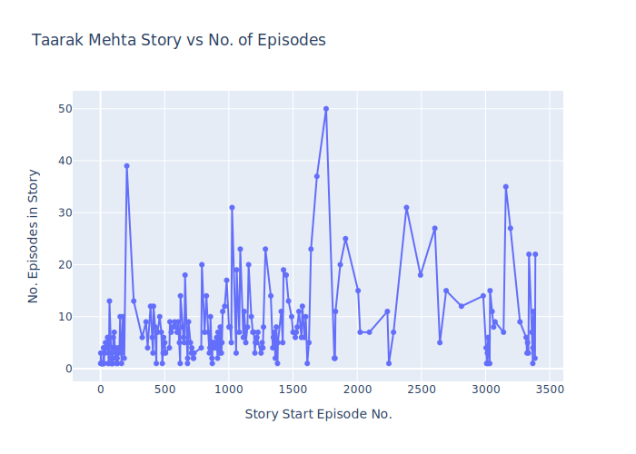

# Analysis of No. Of Episodes per Story in TMKOC

## Sources / Inspiration 

- https://www.youtube.com/watch?v=Rkq6yHZtw0k
- https://en.wikipedia.org/wiki/Taarak_Mehta_Ka_Ooltah_Chashmah

## Why 

- I felt tmkoc show is becomming less interesting over time so i thought to do a analysis over it
- To Prove The lack of new stories in the show in past years 
- Just out of Curiosity & Just Because

# By this Analysis we can conclude
- New Stories were more frequent in in the start 
- The show is becomming lengthy over time starting from episode 1600's to 3000's 
- The frequency of sotries is again increasing 

also the stories with most no of episodes are most of times lengthy and just boring
